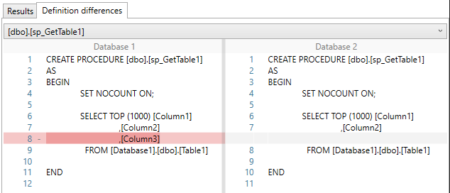

# QuickCompare

[](https://github.com/Scandal-UK/QuickCompare/actions?query=workflow%3A%22Build%20and%20Test%22)
[](https://github.com/Scandal-UK/QuickCompare/actions?query=workflow%3ACodeQL)
[](https://sonarcloud.io/dashboard?id=Scandal-UK_QuickCompare)
[](https://sonarcloud.io/dashboard?id=Scandal-UK_QuickCompare)
[](https://sonarcloud.io/dashboard?id=Scandal-UK_QuickCompare)
[](https://sonarcloud.io/summary/new_code?id=Scandal-UK_QuickCompare)

> A simple, fast and free SQL Server schema comparison library for .NET.

QuickCompare compares the schemas of two Microsoft SQL Server databases and reports the differences between them.

It can be used programmatically from .NET applications and CI/CD pipelines, or through the included Windows application. Comparisons use `INFORMATION_SCHEMA` views and are designed to have minimal impact on the databases being inspected.



## Features

- Compare Microsoft SQL Server database schemas
- Ignore insignificant differences such as whitespace and comments
- Use directly from C# or automated CI/CD pipelines
- Low-impact asynchronous database queries
- Progress reporting through status events
- Backwards-compatible SQL queries
- Fully unit tested
- Free and open source

## Usage

The `DifferenceBuilder` compares the databases configured through `QuickCompareOptions`:

```csharp
var settings = new QuickCompareOptions
{
    ConnectionString1 = "Data Source=localhost\\SQLEXPRESS;Initial Catalog=Northwind1;Integrated Security=True",
    ConnectionString2 = "Data Source=localhost\\SQLEXPRESS;Initial Catalog=Northwind2;Integrated Security=True",
};

IOptions<QuickCompareOptions> options = Options.Create(settings);

var builder = new DifferenceBuilder(options);

await builder.BuildDifferencesAsync();

string outputText = builder.Differences.ToString();
```

In a normal application, `QuickCompareOptions` would usually be supplied through dependency injection and application configuration.

## Projects

- **QuickCompareModel** — core comparison library and NuGet package source
- **ConsoleTestQuickCompare** — sample console application
- **WinQuickCompare** — sample Windows application

## Contributing

Issues and pull requests are welcome. If you find QuickCompare useful, consider starring the repository.

## Licence

Licensed under the Apache License 2.0.
